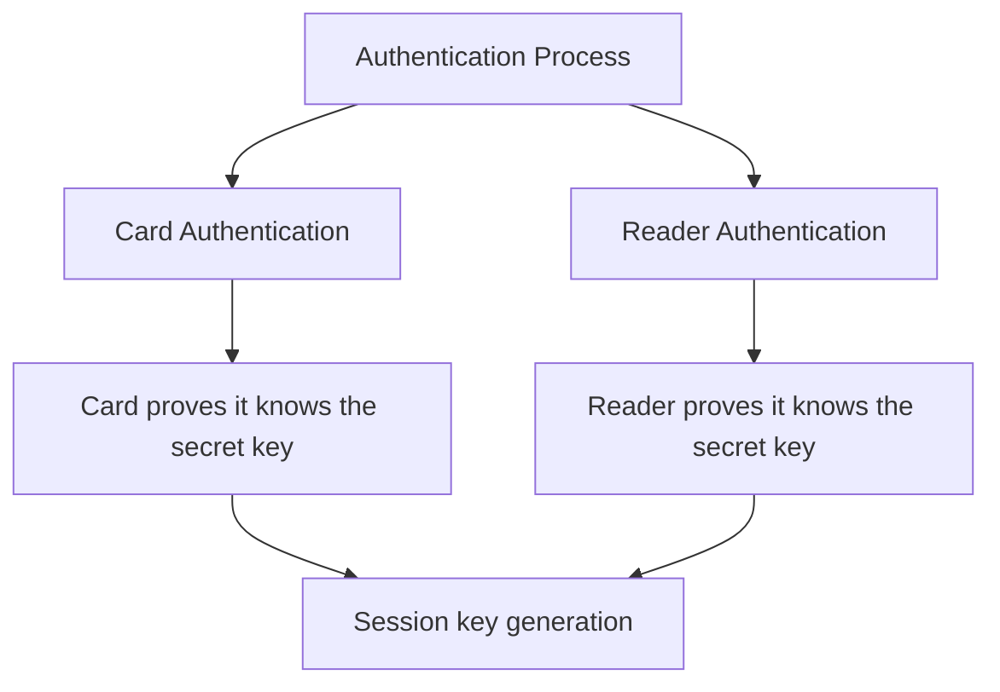
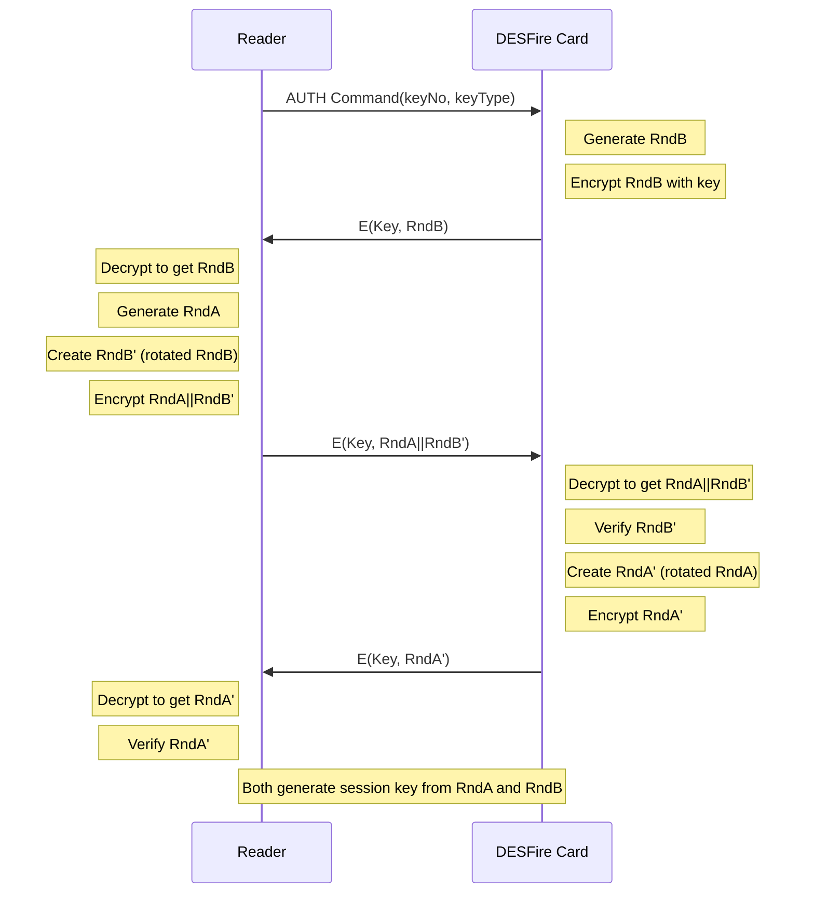
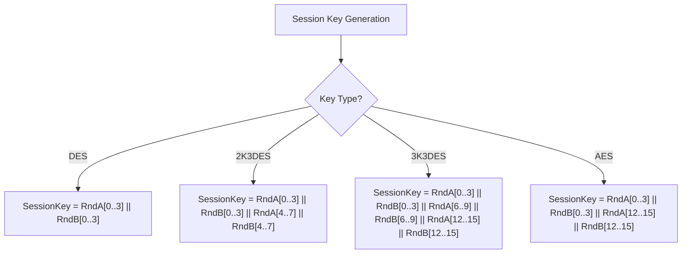
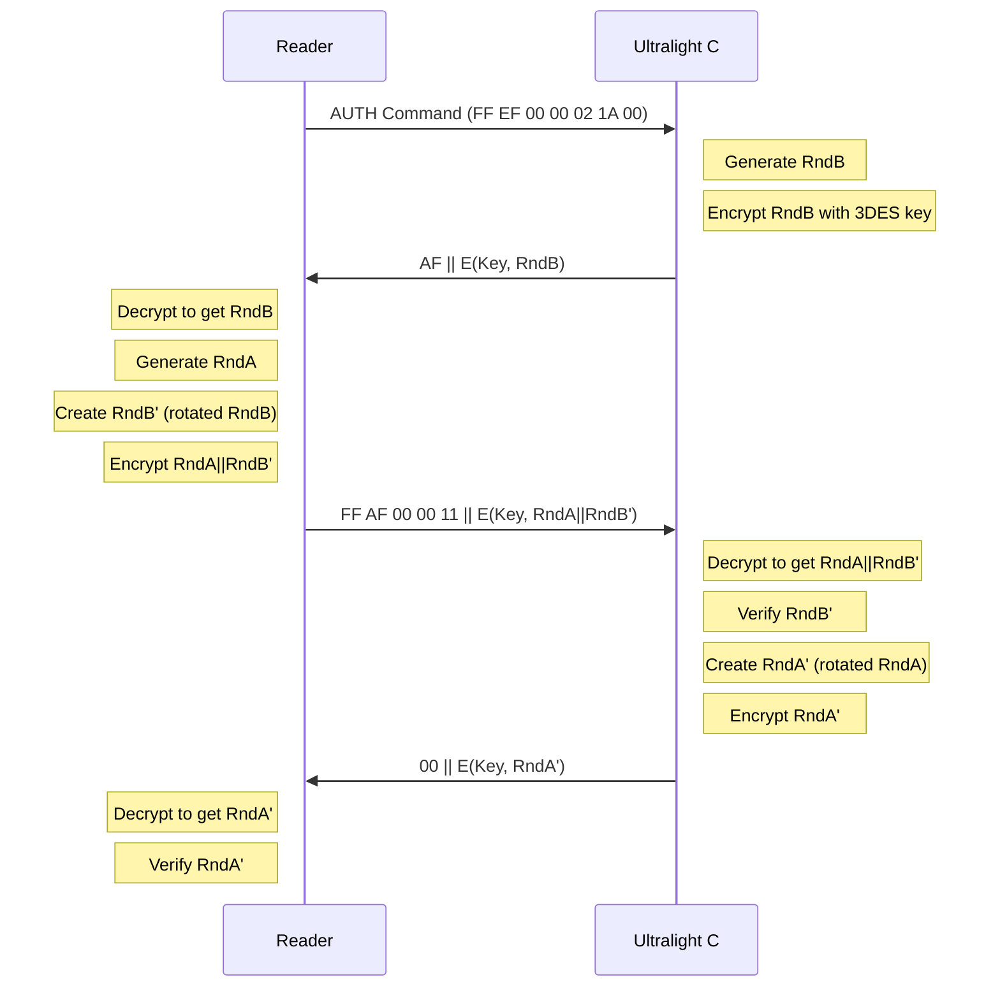

# Authentication Protocols

Both MIFARE DESFire EV1 and MIFARE Ultralight C use mutual authentication protocols based on cryptographic challenge-response mechanisms. This document details these authentication procedures and provides implementation guidelines.

## Authentication Overview

Mutual authentication ensures that both the card reader (PCD) and the card (PICC) authenticate each other. This prevents unauthorized access to the card and protects against replay and man-in-the-middle attacks.



## DESFire EV1 Authentication

DESFire EV1 supports four different authentication methods:

1. **DES Authentication**
2. **2K3DES Authentication**
3. **3K3DES Authentication**
4. **AES Authentication**

### Authentication Protocol Flow



### Session Key Generation

After successful authentication, both the reader and card generate the same session key:



### Command APDUs

#### DES and 2K3DES Authentication

```
Command: 90 0A 00 00 01 [keyNo]
Response: [8 bytes encrypted RndB] AF
```

#### 3K3DES Authentication

```
Command: 90 1A 00 00 01 [keyNo]
Response: [16 bytes encrypted RndB] AF
```

#### AES Authentication

```
Command: 90 AA 00 00 01 [keyNo]
Response: [16 bytes encrypted RndB] AF
```

#### Authentication Part 2 (All Methods)

```
Command: 90 AF 00 00 [length] [encrypted RndA || RndB']
Response: [encrypted RndA'] 00
```

## Ultralight C Authentication

Ultralight C uses a simpler authentication protocol based only on 3DES:

### Authentication Protocol Flow



### Command APDUs

#### Initial Authentication Command

```
Command: FF EF 00 00 02 1A 00
Response: AF [8 bytes encrypted RndB]
```

#### Authentication Part 2

```
Command: FF AF 00 00 11 [16 bytes encrypted (RndA || RndB')]
Response: 00 [8 bytes encrypted RndA']
```

## Cryptographic Operations

### Random Number Rotation

Both protocols use rotation of random numbers as part of the authentication:

```
// For 8-byte random numbers (DES, 2K3DES, and Ultralight C)
RndX' = RndX[1..7] || RndX[0]

// For 16-byte random numbers (3K3DES, AES)
RndX' = RndX[1..15] || RndX[0]
```

This operation shifts all bytes one position to the left, with the first byte moving to the end.

### Encryption Algorithms

#### DES Encryption/Decryption

For DES, a single-length DES key (8 bytes) is used with CBC mode:

```java
IvParameterSpec iv = new IvParameterSpec(new byte[8]);
SecretKey skey = new SecretKeySpec(key, "DES");
Cipher cipher = Cipher.getInstance("DES/CBC/NoPadding");
cipher.init(Cipher.ENCRYPT_MODE, skey, iv);
byte[] ciphertext = cipher.doFinal(plaintext);
```

#### 2K3DES Encryption/Decryption

For 2K3DES, a 16-byte key (K1||K2) is used with 3DES in CBC mode:

```java
IvParameterSpec iv = new IvParameterSpec(new byte[8]);
SecretKey skey = new SecretKeySpec(key, "DESede");
Cipher cipher = Cipher.getInstance("DESede/CBC/NoPadding");
cipher.init(Cipher.ENCRYPT_MODE, skey, iv);
byte[] ciphertext = cipher.doFinal(plaintext);
```

#### 3K3DES Encryption/Decryption

For 3K3DES, a 24-byte key (K1||K2||K3) is used with 3DES in CBC mode:

```java
IvParameterSpec iv = new IvParameterSpec(new byte[8]);
SecretKey skey = new SecretKeySpec(key, "DESede");
Cipher cipher = Cipher.getInstance("DESede/CBC/NoPadding");
cipher.init(Cipher.ENCRYPT_MODE, skey, iv);
byte[] ciphertext = cipher.doFinal(plaintext);
```

#### AES Encryption/Decryption

For AES, a 16-byte key is used with AES in CBC mode:

```java
IvParameterSpec iv = new IvParameterSpec(new byte[16]);
SecretKey skey = new SecretKeySpec(key, "AES");
Cipher cipher = Cipher.getInstance("AES/CBC/NoPadding");
cipher.init(Cipher.ENCRYPT_MODE, skey, iv);
byte[] ciphertext = cipher.doFinal(plaintext);
```

## Authentication Implementation Guidelines

### Key Management

1. **Secure Key Storage**: Store keys securely, preferably in hardware-based secure elements.
2. **Key Diversification**: Use card-specific diversification data to create unique keys for each card.
3. **Key Rotation**: Periodically change keys to enhance security.

### Implementation Steps

#### DESFire EV1 Authentication

1. Select the application on the card (DESFire specific)
2. Send the authentication command with the key number
3. Receive the encrypted random number B
4. Decrypt random number B using the shared secret key
5. Generate random number A
6. Rotate random number B (shift left one position)
7. Concatenate A and rotated B
8. Encrypt the concatenation using the shared secret key
9. Send the encrypted value to the card
10. Receive the encrypted rotated random number A
11. Decrypt and verify that it matches the expected rotated A
12. Generate the session key from random numbers A and B
13. Use the session key for subsequent communications

#### Ultralight C Authentication

1. Send the authentication request command
2. Receive the encrypted random number B
3. Decrypt random number B using the shared 3DES key
4. Generate random number A
5. Rotate random number B (shift left one position)
6. Concatenate A and rotated B
7. Encrypt the concatenation using the shared 3DES key
8. Send the encrypted value to the card
9. Receive the encrypted rotated random number A
10. Decrypt and verify that it matches the expected rotated A

## Error Handling

Authentication can fail for several reasons:

| Error | Description          | Handling                   |
| ----- | -------------------- | -------------------------- |
| 0xAE  | Authentication error | Retry with correct key     |
| 0x1E  | Integrity error      | Communication issue, retry |
| 0x40  | No such key          | Check key number           |
| 0x9D  | Permission denied    | Check access rights        |
| 0xCA  | Command aborted      | Protocol error, reset      |

Always reset the authentication state after a failed authentication attempt.
