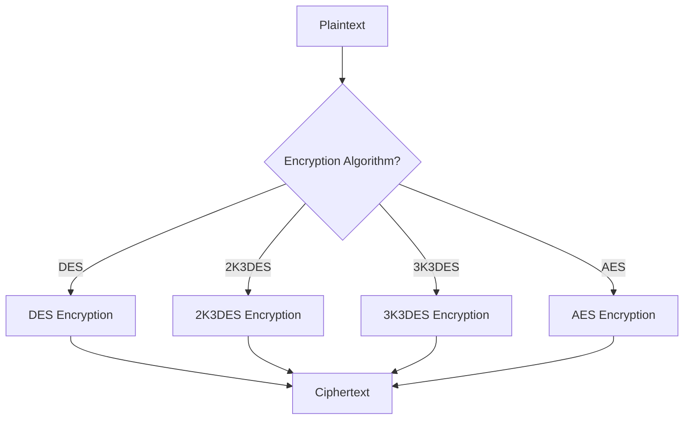

# Cryptographic Operations

MIFARE DESFire EV1 and MIFARE Ultralight C both use cryptographic operations to secure communications and protect data. This document describes the cryptographic algorithms and operations used in both card types.

## Supported Encryption Algorithms

### DESFire EV1 Algorithms

DESFire EV1 supports the following encryption algorithms:

1. **DES (Data Encryption Standard)**

   - 56-bit key (8 bytes with parity bits)
   - Legacy algorithm, not recommended for new applications

2. **2K3DES (Two-Key Triple DES)**

   - 112-bit key (16 bytes with parity bits)
   - K1 || K2 format, where the actual key used is K1 || K2 || K1
   - Provides medium security

3. **3K3DES (Three-Key Triple DES)**

   - 168-bit key (24 bytes with parity bits)
   - K1 || K2 || K3 format
   - Provides strong security

4. **AES (Advanced Encryption Standard)**
   - 128-bit key (16 bytes)
   - Most secure option, recommended for new applications

### Ultralight C Algorithms

Ultralight C only supports:

1. **3DES (Triple DES)**
   - 112-bit key (16 bytes with parity bits)
   - Uses K1 || K2 format

## Cryptographic Operations

Several cryptographic operations are used across the protocols:

### Encryption and Decryption



#### DES Encryption/Decryption

```java
// DES encryption with CBC mode
public static byte[] encrypt(byte[] iv, byte[] key, byte[] data) {
    SecretKey secretKey = new SecretKeySpec(key, "DES");
    Cipher cipher = Cipher.getInstance("DES/CBC/NoPadding");
    IvParameterSpec ivSpec = new IvParameterSpec(iv);
    cipher.init(Cipher.ENCRYPT_MODE, secretKey, ivSpec);
    return cipher.doFinal(data);
}

// DES decryption with CBC mode
public static byte[] decrypt(byte[] iv, byte[] key, byte[] data) {
    SecretKey secretKey = new SecretKeySpec(key, "DES");
    Cipher cipher = Cipher.getInstance("DES/CBC/NoPadding");
    IvParameterSpec ivSpec = new IvParameterSpec(iv);
    cipher.init(Cipher.DECRYPT_MODE, secretKey, ivSpec);
    return cipher.doFinal(data);
}
```

#### 2K3DES Encryption/Decryption

For 2K3DES, a 16-byte key (K1 || K2) is used with the DESede (Triple DES) algorithm:

```java
// 2K3DES encryption with CBC mode
public static byte[] encrypt(byte[] iv, byte[] key, byte[] data) {
    // For 2K3DES, we need to convert the 16-byte key (K1||K2) to 24-byte key (K1||K2||K1)
    byte[] fullKey = new byte[24];
    System.arraycopy(key, 0, fullKey, 0, 16);
    System.arraycopy(key, 0, fullKey, 16, 8);

    SecretKey secretKey = new SecretKeySpec(fullKey, "DESede");
    Cipher cipher = Cipher.getInstance("DESede/CBC/NoPadding");
    IvParameterSpec ivSpec = new IvParameterSpec(iv);
    cipher.init(Cipher.ENCRYPT_MODE, secretKey, ivSpec);
    return cipher.doFinal(data);
}

// 2K3DES decryption with CBC mode
public static byte[] decrypt(byte[] iv, byte[] key, byte[] data) {
    // Same key expansion as above
    byte[] fullKey = new byte[24];
    System.arraycopy(key, 0, fullKey, 0, 16);
    System.arraycopy(key, 0, fullKey, 16, 8);

    SecretKey secretKey = new SecretKeySpec(fullKey, "DESede");
    Cipher cipher = Cipher.getInstance("DESede/CBC/NoPadding");
    IvParameterSpec ivSpec = new IvParameterSpec(iv);
    cipher.init(Cipher.DECRYPT_MODE, secretKey, ivSpec);
    return cipher.doFinal(data);
}
```

#### 3K3DES Encryption/Decryption

For 3K3DES, a 24-byte key (K1 || K2 || K3) is used:

```java
// 3K3DES encryption with CBC mode
public static byte[] encrypt(byte[] iv, byte[] key, byte[] data) {
    SecretKey secretKey = new SecretKeySpec(key, "DESede");
    Cipher cipher = Cipher.getInstance("DESede/CBC/NoPadding");
    IvParameterSpec ivSpec = new IvParameterSpec(iv);
    cipher.init(Cipher.ENCRYPT_MODE, secretKey, ivSpec);
    return cipher.doFinal(data);
}

// 3K3DES decryption with CBC mode
public static byte[] decrypt(byte[] iv, byte[] key, byte[] data) {
    SecretKey secretKey = new SecretKeySpec(key, "DESede");
    Cipher cipher = Cipher.getInstance("DESede/CBC/NoPadding");
    IvParameterSpec ivSpec = new IvParameterSpec(iv);
    cipher.init(Cipher.DECRYPT_MODE, secretKey, ivSpec);
    return cipher.doFinal(data);
}
```

#### AES Encryption/Decryption

For AES, a 16-byte key is used:

```java
// AES encryption with CBC mode
public static byte[] encrypt(byte[] iv, byte[] key, byte[] data) {
    SecretKey secretKey = new SecretKeySpec(key, "AES");
    Cipher cipher = Cipher.getInstance("AES/CBC/NoPadding");
    IvParameterSpec ivSpec = new IvParameterSpec(iv);
    cipher.init(Cipher.ENCRYPT_MODE, secretKey, ivSpec);
    return cipher.doFinal(data);
}

// AES decryption with CBC mode
public static byte[] decrypt(byte[] iv, byte[] key, byte[] data) {
    SecretKey secretKey = new SecretKeySpec(key, "AES");
    Cipher cipher = Cipher.getInstance("AES/CBC/NoPadding");
    IvParameterSpec ivSpec = new IvParameterSpec(iv);
    cipher.init(Cipher.DECRYPT_MODE, secretKey, ivSpec);
    return cipher.doFinal(data);
}
```

### Message Authentication Codes (MAC)

DESFire uses MACs for integrity protection in the MACed communication mode:

#### CMAC (Cipher-based MAC)

Used with AES keys:

```java
// CMAC calculation
public static byte[] calculateCMAC(byte[] key, byte[] data) {
    try {
        // Some platforms may not support CMAC directly,
        // so this shows a basic implementation:
        byte[] iv = new byte[16];
        Cipher cipher = Cipher.getInstance("AES/CBC/NoPadding");
        SecretKey secretKey = new SecretKeySpec(key, "AES");

        // First, pad the data if needed
        byte[] paddedData = padData(data);

        // Process all blocks except the last one
        for (int i = 0; i < paddedData.length - 16; i += 16) {
            byte[] block = Arrays.copyOfRange(paddedData, i, i + 16);
            for (int j = 0; j < 16; j++) {
                iv[j] ^= block[j];
            }
            IvParameterSpec ivSpec = new IvParameterSpec(new byte[16]);
            cipher.init(Cipher.ENCRYPT_MODE, secretKey, ivSpec);
            iv = cipher.doFinal(iv);
        }

        // Process the last block
        byte[] lastBlock = Arrays.copyOfRange(paddedData, paddedData.length - 16, paddedData.length);
        for (int j = 0; j < 16; j++) {
            iv[j] ^= lastBlock[j];
        }
        IvParameterSpec ivSpec = new IvParameterSpec(new byte[16]);
        cipher.init(Cipher.ENCRYPT_MODE, secretKey, ivSpec);
        byte[] mac = cipher.doFinal(iv);

        // Return the first 8 bytes as the MAC
        return Arrays.copyOf(mac, 8);
    } catch (Exception e) {
        return null;
    }
}

// Helper method to pad data according to CMAC requirements
private static byte[] padData(byte[] data) {
    int remainder = data.length % 16;
    int paddingLength = (remainder == 0) ? 16 : 16 - remainder;
    byte[] paddedData = new byte[data.length + paddingLength];
    System.arraycopy(data, 0, paddedData, 0, data.length);
    paddedData[data.length] = (byte) 0x80;
    return paddedData;
}
```

#### MAC for DES and Triple DES

Used with DES and 3DES keys:

```java
// MAC calculation for DES/3DES
public static byte[] calculateMAC(byte[] key, byte[] data) {
    try {
        byte[] iv = new byte[8];
        Cipher cipher = Cipher.getInstance("DES/CBC/NoPadding");

        // Pad the data if needed
        byte[] paddedData = padData(data);

        // Process all blocks
        for (int i = 0; i < paddedData.length; i += 8) {
            byte[] block = Arrays.copyOfRange(paddedData, i, i + 8);
            for (int j = 0; j < 8; j++) {
                iv[j] ^= block[j];
            }

            // For the last block, use the final key
            if (i == paddedData.length - 8) {
                SecretKey secretKey = new SecretKeySpec(key, "DES");
                IvParameterSpec ivSpec = new IvParameterSpec(new byte[8]);
                cipher.init(Cipher.ENCRYPT_MODE, secretKey, ivSpec);
                iv = cipher.doFinal(iv);
            } else {
                // Use the session key for intermediate blocks
                SecretKey secretKey = new SecretKeySpec(Arrays.copyOf(key, 8), "DES");
                IvParameterSpec ivSpec = new IvParameterSpec(new byte[8]);
                cipher.init(Cipher.ENCRYPT_MODE, secretKey, ivSpec);
                iv = cipher.doFinal(iv);
            }
        }

        return iv;
    } catch (Exception e) {
        return null;
    }
}

// Helper method to pad data for MAC
private static byte[] padData(byte[] data) {
    int remainder = data.length % 8;
    int paddingLength = (remainder == 0) ? 8 : 8 - remainder;
    byte[] paddedData = new byte[data.length + paddingLength];
    System.arraycopy(data, 0, paddedData, 0, data.length);
    paddedData[data.length] = (byte) 0x80;
    return paddedData;
}
```

### CRC Calculation

DESFire uses CRC (Cyclic Redundancy Check) for data integrity:

#### CRC16

Used for standard data integrity checking:

```java
// CRC16 calculation using the CCITT polynomial (0x1021)
public static int calculateCRC16(byte[] data) {
    int crc = 0x6363; // Initial value for DESFire

    for (byte b : data) {
        byte ch = (byte) (b ^ (crc & 0xff));
        ch = (byte) (ch ^ ((ch << 4) & 0xff));
        crc = ((crc >> 8) ^ (ch << 8) ^ (ch << 3) ^ (ch >> 4)) & 0xffff;
    }

    return crc;
}

// Convert the CRC to bytes
public static byte[] getCRC16Bytes(byte[] data) {
    int crc = calculateCRC16(data);
    byte[] crcBytes = new byte[2];
    crcBytes[0] = (byte) (crc & 0xff);
    crcBytes[1] = (byte) ((crc >> 8) & 0xff);
    return crcBytes;
}
```

#### CRC32

Used for higher security applications:

```java
// CRC32 calculation
public static long calculateCRC32(byte[] data) {
    java.util.zip.CRC32 crc32 = new java.util.zip.CRC32();
    crc32.update(data);
    return crc32.getValue();
}

// Convert the CRC to bytes
public static byte[] getCRC32Bytes(byte[] data) {
    long crc = calculateCRC32(data);
    byte[] crcBytes = new byte[4];
    crcBytes[0] = (byte) (crc & 0xff);
    crcBytes[1] = (byte) ((crc >> 8) & 0xff);
    crcBytes[2] = (byte) ((crc >> 16) & 0xff);
    crcBytes[3] = (byte) ((crc >> 24) & 0xff);
    return crcBytes;
}
```

## Key Management

### Key Diversification

Key diversification allows deriving unique keys for each card from a master key:

```java
// Simple key diversification using AES
public static byte[] diversifyKey(byte[] masterKey, byte[] uid) {
    try {
        SecretKey secretKey = new SecretKeySpec(masterKey, "AES");
        Cipher cipher = Cipher.getInstance("AES/ECB/NoPadding");
        cipher.init(Cipher.ENCRYPT_MODE, secretKey);

        // Ensure UID is padded to 16 bytes
        byte[] paddedUid = new byte[16];
        System.arraycopy(uid, 0, paddedUid, 0, Math.min(uid.length, 16));

        return cipher.doFinal(paddedUid);
    } catch (Exception e) {
        return null;
    }
}
```

### Key Version

DESFire uses key versions, which are stored in the least significant bits of each key byte:

```java
// Set key version (for DES/3DES keys)
public static void setKeyVersion(byte[] key, byte version) {
    for (int i = 0; i < key.length; i++) {
        // Clear the least significant bit
        key[i] &= 0xFE;
        // Set the version bit
        key[i] |= (version & 0x01);
        // Rotate version for next byte
        version = (byte) ((version >> 1) | ((version & 0x01) << 7));
    }
}

// Get key version from key
public static byte getKeyVersion(byte[] key) {
    byte version = 0;
    for (int i = 0; i < key.length; i++) {
        // Get the least significant bit
        version |= ((key[i] & 0x01) << i);
    }
    return version;
}
```

## Communication Security Modes

DESFire supports three communication modes:

### Plain Mode

No encryption, only used for non-sensitive operations:

```
PCD -> PICC: CMD | Data
PICC -> PCD: Response
```

### MACed Mode

Messages are appended with a MAC for integrity protection:

```
PCD -> PICC: CMD | Data | MAC(SessionKey, CMD|Data)
PICC -> PCD: Response | MAC(SessionKey, Response)
```

Implementation:

```java
// Prepare MACed command
public static byte[] prepareMacedCommand(byte[] apdu, byte[] sessionKey) {
    // Extract command data
    byte[] cmdData = Arrays.copyOfRange(apdu, 5, apdu.length);

    // Calculate MAC
    byte[] mac = calculateMAC(sessionKey, cmdData);

    // Append MAC to command
    byte[] macedApdu = new byte[apdu.length + 8];
    System.arraycopy(apdu, 0, macedApdu, 0, apdu.length);
    System.arraycopy(mac, 0, macedApdu, apdu.length, 8);

    // Update length byte
    macedApdu[4] = (byte) (cmdData.length + 8);

    return macedApdu;
}

// Verify MACed response
public static boolean verifyMacedResponse(byte[] response, byte[] sessionKey) {
    if (response.length < 10) { // At least 2 status bytes + 8 MAC bytes
        return false;
    }

    // Extract response data and MAC
    byte[] respData = Arrays.copyOfRange(response, 0, response.length - 10);
    byte[] receivedMac = Arrays.copyOfRange(response, response.length - 10, response.length - 2);

    // Calculate expected MAC
    byte[] expectedMac = calculateMAC(sessionKey, respData);

    // Compare MACs
    return Arrays.equals(receivedMac, expectedMac);
}
```

### Enciphered Mode

Full encryption for confidentiality and integrity:

```
PCD -> PICC: CMD | E(SessionKey, Data|CRC)
PICC -> PCD: E(SessionKey, Response|CRC)
```

Implementation:

```java
// Prepare enciphered command
public static byte[] prepareEncipheredCommand(byte[] apdu, byte[] sessionKey, byte[] iv) {
    // Extract command data
    byte[] cmdData = Arrays.copyOfRange(apdu, 5, apdu.length);

    // Calculate CRC
    byte[] crc = getCRC32Bytes(cmdData);

    // Concatenate data and CRC
    byte[] dataWithCrc = new byte[cmdData.length + 4];
    System.arraycopy(cmdData, 0, dataWithCrc, 0, cmdData.length);
    System.arraycopy(crc, 0, dataWithCrc, cmdData.length, 4);

    // Pad if needed
    byte[] paddedData = padData(dataWithCrc);

    // Encrypt
    byte[] encryptedData = encrypt(iv, sessionKey, paddedData);

    // Create new APDU with encrypted data
    byte[] encApdu = new byte[5 + encryptedData.length];
    System.arraycopy(apdu, 0, encApdu, 0, 5);
    System.arraycopy(encryptedData, 0, encApdu, 5, encryptedData.length);

    // Update length byte
    encApdu[4] = (byte) encryptedData.length;

    return encApdu;
}

// Decrypt and verify enciphered response
public static byte[] decryptEncipheredResponse(byte[] response, byte[] sessionKey, byte[] iv) {
    if (response.length < 6) { // At least encrypted data + status bytes
        return null;
    }

    // Extract encrypted data
    byte[] encryptedData = Arrays.copyOfRange(response, 0, response.length - 2);

    // Decrypt
    byte[] decryptedData = decrypt(iv, sessionKey, encryptedData);

    // Verify CRC
    byte[] data = Arrays.copyOfRange(decryptedData, 0, decryptedData.length - 4);
    byte[] receivedCrc = Arrays.copyOfRange(decryptedData, decryptedData.length - 4, decryptedData.length);
    byte[] expectedCrc = getCRC32Bytes(data);

    if (!Arrays.equals(receivedCrc, expectedCrc)) {
        return null; // CRC mismatch
    }

    return data;
}
```

## Secure Key Storage

When implementing NFC applications, secure key storage is essential:

### Java/Android

```java
// Android KeyStore example
public static SecretKey generateAndStoreKey(String keyAlias) {
    try {
        KeyGenerator keyGenerator = KeyGenerator.getInstance(
                KeyProperties.KEY_ALGORITHM_AES,
                "AndroidKeyStore");

        keyGenerator.init(new KeyGenParameterSpec.Builder(
                keyAlias,
                KeyProperties.PURPOSE_ENCRYPT | KeyProperties.PURPOSE_DECRYPT)
                .setBlockModes(KeyProperties.BLOCK_MODE_CBC)
                .setEncryptionPaddings(KeyProperties.ENCRYPTION_PADDING_NONE)
                .setKeySize(128)
                .build());

        return keyGenerator.generateKey();
    } catch (Exception e) {
        return null;
    }
}
```

### C++/Native

For C++ applications, consider using platform-specific secure storage:

- Windows: Windows CNG or DPAPI
- Linux: PKCS#11 or Trusted Platform Module (TPM)
- macOS: Keychain

### Web/TypeScript

For web applications, WebCrypto provides a way to generate and use keys:

```typescript
// Generate a key for use with WebCrypto
async function generateKey(): Promise<CryptoKey> {
  return await window.crypto.subtle.generateKey(
    {
      name: "AES-CBC",
      length: 128,
    },
    false, // extractable
    ["encrypt", "decrypt"]
  );
}
```

## Security Considerations

When implementing cryptographic operations for MIFARE cards, consider these security practices:

1. **Use Hardened Algorithms**: Prefer AES over DES/3DES for DESFire applications

2. **Key Diversification**: Always diversify keys per card to limit the impact of key compromise

3. **Secure Against Side-Channel Attacks**:

   - Implement constant-time comparisons for MACs and other sensitive data
   - Avoid logging sensitive information
   - Clear sensitive data from memory after use

4. **Use Enciphered Mode**: For sensitive operations, always use fully encrypted communication

5. **Verify All Responses**: Always check status codes and CRC/MAC values
