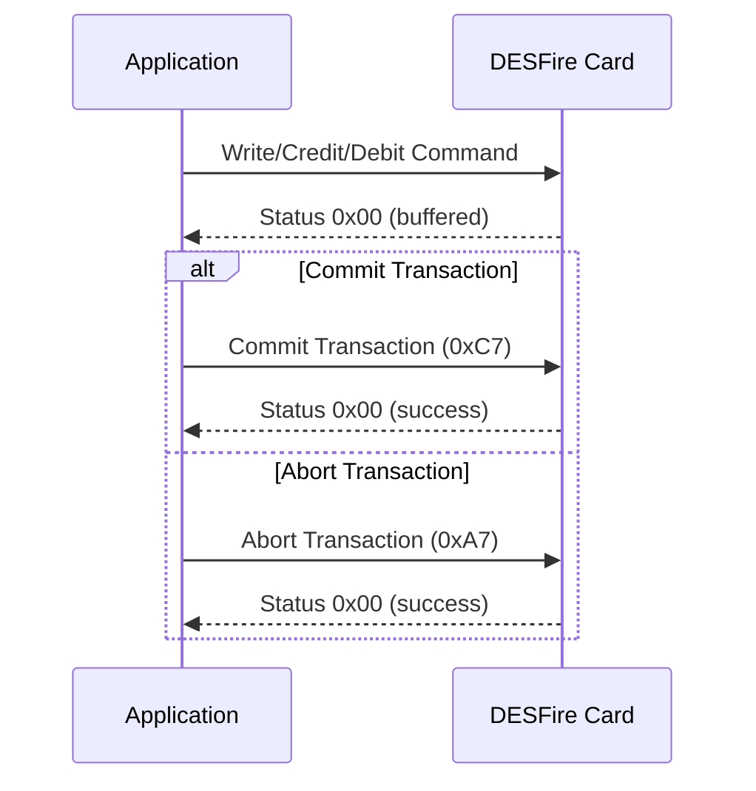
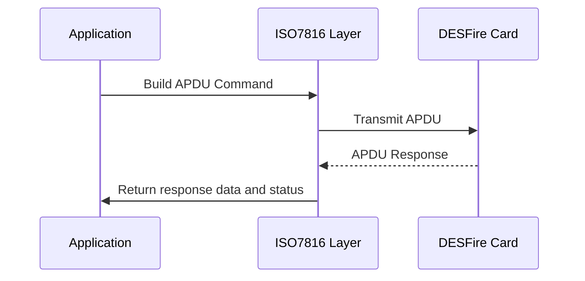
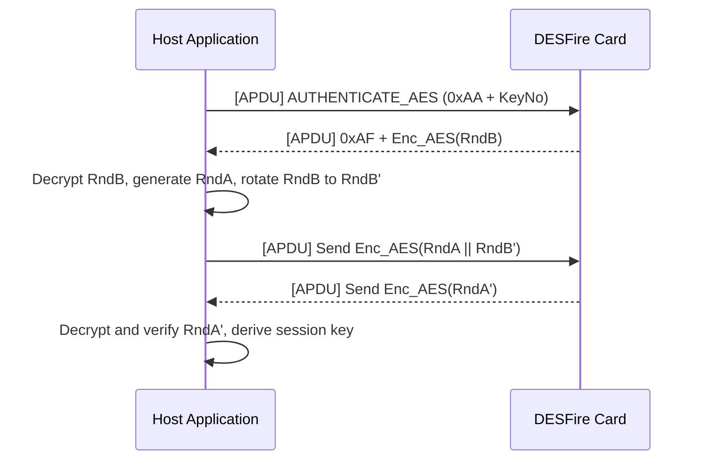
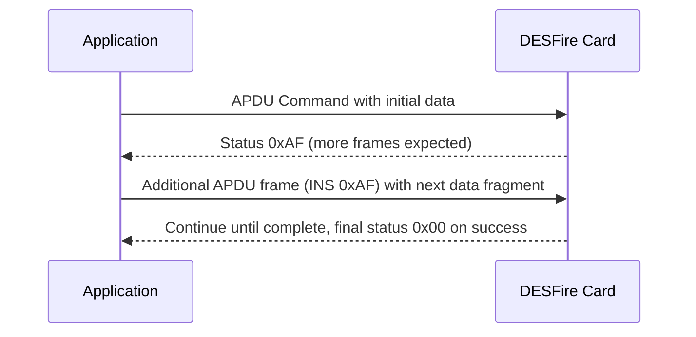

This additional documentation is extremely valuable. It not only confirms many of the details we already have but also provides extra insights into the command structure, encryption modes, and even transaction handling. Based on the information from the HackMD document and the LibLogicalAccess GitHub repository, I've enhanced our current documentation as follows:

---

# Enhanced Comprehensive API & Protocol Definition for DESFire EV1/EV2 Authentication

> **Note:** The following documentation is a synthesis of multiple public sources—including reverse‑engineering reports, community examples, the HackMD document by FabAccess, and insights from the [liblogicalaccess](https://github.com/liblogicalaccess/liblogicalaccess) repository. Because NXP’s official documentation is only available under NDA, some parameters may need further tuning for your specific hardware and cryptographic mode (DES/3DES vs. AES).

---

## Table of Contents

- [1. Overview](#1-overview)
- [2. APDU Wrapping & ISO 7816‑4 Command Format](#2-apdu-wrapping--iso-78164-command-format)
- [3. Command Structure](#3-command-structure)
- [4. Authentication Process](#4-authentication-process)
  - [4.1 Legacy Authentication (D40)](#41-legacy-authentication-d40)
  - [4.2 ISO Authentication (EV1)](#42-iso-authentication-ev1)
  - [4.3 AES Authentication (EV1)](#43-aes-authentication-ev1)
  - [4.4 EV2 Authentication](#44-ev2-authentication)
- [5. Encryption Modes & IV Management](#5-encryption-modes--iv-management)
- [6. Session Key Derivation](#6-session-key-derivation)
- [7. Common Operations](#7-common-operations)
  - [7.1 Application Management](#71-application-management)
  - [7.2 File Operations](#72-file-operations)
  - [7.3 Transaction Mechanism](#73-transaction-mechanism)
- [8. API Outline for Arduino Library](#8-api-outline-for-arduino-library)
- [9. Additional Details from LibLogicalAccess Documentation](#9-additional-details-from-liblogicalaccess-documentation)
- [10. Communication Sequence Diagrams](#10-communication-sequence-diagrams)
- [11. Error Handling & Security Considerations](#11-error-handling--security-considerations)
- [12. Conclusion](#12-conclusion)

---

## 1. Overview

MIFARE DESFire EV1 and EV2 cards are high‑security, multi‑application contactless smartcards that comply with ISO/IEC 14443A. They support several cryptographic algorithms:
- **DES/3DES:** In 2‑key (2K3DES) or 3‑key (3K3DES) modes (8‑byte blocks)
- **AES:** Using 16‑byte blocks

Authentication uses a three‑pass challenge–response protocol that not only verifies that both parties share the secret key but also establishes a session key for subsequent secure messaging. DESFire native commands are commonly wrapped into ISO 7816‑4 APDUs.

---

## 2. APDU Wrapping & ISO 7816‑4 Command Format

According to the documentation:

- **Command APDU Structure:**
  - **CLA (1 byte):** Typically `0x90` (also defined as `DF_CLA_ISO_WRAP`)
  - **INS (1 byte):** The instruction code (e.g., `0x5A` for “Select Application”, `0x1A` for “Get Challenge”)
  - **P1 (1 byte) & P2 (1 byte):** Command-specific parameters (often `0x00`)
  - **Lc (1–3 bytes):** Length of the data field (we usually use 1 byte for up to 255 bytes)
  - **Data:** Command-specific payload (e.g., key numbers, AID, challenge responses)
  - **Le (0–3 bytes):** Expected length of the response (0x00 often indicates “up to 255 bytes”)

*Example – “Select Application” APDU:*

| Field | Value |
|-------|-------|
| CLA   | 0x90  |
| INS   | 0x5A  |
| P1/P2 | 0x00/0x00 |
| Lc    | 0x03  |
| Data  | 0xEE, 0xFF, 0xC0 (the AID in reverse order) |
| Le    | 0x00  |

Full APDU (hex):  
```
90 5A 00 00 03 EE FF C0 00
```
Expected Response: `91 00` indicates success.

- **Response APDU:**  
  Data (if any) followed by status word (SW1-SW2).

---

## 3. Command Structure

Each DESFire command consists of:
1. **Command Code:** A one‑byte instruction (e.g., `DF_INS_AUTHENTICATE`).
2. **Parameters:** Optional command-specific parameters.
3. **Data:** Optional payload.
4. **Mode:** Indicates whether the command uses plain transmission, MAC, or encryption.

Commands are transmitted using a `transmit` method that wraps the native DESFire command inside an ISO 7816‑4 APDU frame and returns an `ISO7816Response` containing:
- **Status Word (SW1-SW2):** Two bytes that indicate the result.
- **Response Data:** Any data returned by the card.

*Example of a simple authentication command:*

```cpp
ByteVector command;
command.push_back(keyNo);  // Key number parameter
auto result = transmit(DF_INS_AUTHENTICATE, command);
```

---

## 4. Authentication Process

Authentication establishes a secure session. The library supports multiple authentication methods depending on the card type and encryption:

### 4.1 Legacy Authentication (D40)
Uses DES/3DES encryption:
- **Step 1:**  
  Host sends an AUTHENTICATE command (e.g., with key number).
- **Step 2:**  
  Card responds with an encrypted random number **RndB**.
- **Step 3:**  
  Host decrypts **RndB**, rotates it one byte left (to get **RndB′**), generates its own **RndA**, concatenates **RndA || RndB′**, encrypts it, and sends it.
- **Step 4:**  
  Card decrypts, verifies **RndB′**, rotates **RndA** left (to get **RndA′**), encrypts it, and sends it back.
- **Step 5:**  
  Host decrypts the response, rotates **RndA′** right, compares with **RndA**. If they match, authentication is successful.
- **Session Key:**  
  Derived from segments of **RndA** and **RndB**.

### 4.2 ISO Authentication (EV1)
Uses ISO 7816‑4 wrapped commands for EV1:
- The process is similar to legacy authentication, but the APDU wrapping follows ISO standards (with CLA=0x90, INS=0x1A, etc.).

### 4.3 AES Authentication (EV1)
For cards operating in AES mode:
- **Step 1:**  
  Host sends AUTHENTICATE_AES (e.g., INS might be `0xAA` with key number).
- **Step 2:**  
  Card responds with 16 encrypted bytes representing **RndB**.
- **Step 3:**  
  Host decrypts **RndB** (using an IV of zero), rotates it left, generates a 16‑byte **RndA**, concatenates **RndA || RndB′** (32 bytes total), encrypts the concatenation, and sends it.
- **Step 4:**  
  Card decrypts, verifies **RndB′**, rotates **RndA** left (to **RndA′**), encrypts, and sends it.
- **Step 5:**  
  Host decrypts the card’s response, rotates **RndA′** right, and compares with its original **RndA**.
- **Session Key:**  
  Derived from **RndA** and **RndB** using an AES‑specific derivation.

### 4.4 EV2 Authentication
DESFire EV2 introduces enhanced security features such as:
- A transaction identifier (TI)
- Command counters for replay protection

The authentication process for EV2 is similar to EV1 but uses different command codes (e.g., `DFEV2_INS_AUTHENTICATE_EV2_FIRST`) and may involve additional steps to establish the TI.

---

## 5. Encryption Modes & IV Management

Commands can be sent in different modes:
- **PLAIN (CM_PLAIN, 0x00):** No encryption.
- **MAC (CM_MAC, 0x01):** Data is sent in clear but appended with a MAC.
- **ENCRYPT (CM_ENCRYPT, 0x03):** Data is encrypted using the session key.

**IV (Initialization Vector) Management:**
- For authentication, the IV for the encryption key is reset to zero **once** when the key is established.
- For subsequent commands, the IV is updated using the last encrypted block (CBC mode).
- Failure to update the IV correctly will result in integrity errors.

---

## 6. Session Key Derivation

After successful authentication, both the host and the card derive a session key from **RndA** and **RndB**. For example:
- **DES/3DES:**  
  - If using 2K3DES, one common approach is:  
    ```
    sessionKey = RndA[0..3] || RndB[0..3] || RndA[0..3] || RndB[0..3]
    ```
  - For 3K3DES, the derivation might use the first half and the second half separately.
- **AES:**  
  - The AES session key is typically derived using selected bytes from **RndA**, **RndB**, and their rotated versions.
  
The exact derivation method may vary based on the secure messaging requirements (EV1 vs. EV2) and should be confirmed with your chosen algorithm.

---

## 7. Common Operations

### 7.1 Application Management

DESFire cards use a multi‑application structure. Operations include:
- **Select Application:**  
  - APDU Example:  
    ```
    90 5A 00 00 03 [AID in reverse order] 00
    ```
- **Create Application:**  
  - Includes parameters such as AID, key settings, and maximum number of keys.
- **Delete Application:**  
  - Deletes the specified AID.

### 7.2 File Operations

DESFire supports several file types:
- **Standard Data Files**
- **Backup Data Files**
- **Value Files**
- **Linear Record Files**
- **Cyclic Record Files**

Common operations include creating files, reading data, writing data, and managing access rights.

### 7.3 Transaction Mechanism

For data integrity, DESFire supports a transaction mechanism. The typical flow:
- **Write/Credit/Debit:**  
  Operations are buffered.
- **Commit Transaction (0xC7):**  
  Permanently writes the changes.
- **Abort Transaction (0xA7):**  
  Discards the buffered changes.

*Mermaid Diagram Example:*



---

## 8. API Outline for Arduino Library

Your Arduino library should provide high‑level functions that abstract the low‑level APDU and cryptographic details.

### 8.1 Authentication Function

```cpp
/**
 * @brief Authenticate with a DESFire card using the specified key.
 * 
 * @param keyNo The key number (e.g., 0x00 for the master key).
 * @param key Pointer to the key (8 bytes for DES/3DES, 16 bytes for AES).
 * @param sessionKey Buffer to store the derived session key.
 * @return true if authentication succeeded, false otherwise.
 */
bool authenticate(uint8_t keyNo, const uint8_t* key, uint8_t* sessionKey);
```

This function should:
- Build the authentication APDU (e.g., CLA=0x90, INS=0x1A for ISO authentication).
- Handle the three‑pass challenge–response (decryption, rotation, re‑encryption).
- Verify the final response.
- Derive and return the session key.

### 8.2 APDU Builder Function

```cpp
/**
 * @brief Build an APDU frame.
 * 
 * @param ins Instruction code.
 * @param p1 First parameter.
 * @param p2 Second parameter.
 * @param data Pointer to the data payload.
 * @param dataLen Length of data.
 * @param apduBuffer Buffer for the complete APDU.
 * @param apduLen Output parameter for total APDU length.
 */
void buildAPDU(uint8_t ins, uint8_t p1, uint8_t p2,
               const uint8_t* data, size_t dataLen,
               uint8_t* apduBuffer, size_t &apduLen);
```

### 8.3 Secure Messaging Functions

For post-authentication commands:
- Encrypt command payloads using the session key and CBC mode.
- Calculate and append a CMAC if required.
- Update the IV after each transmission.

```cpp
bool sendSecureCommand(uint8_t ins, const uint8_t* data, size_t dataLen, 
                       uint8_t* response, size_t &responseLen);
void updateIV(const uint8_t* lastEncryptedBlock);
```

---

## 9. Additional Details from LibLogicalAccess Documentation

The comprehensive documentation you provided from the liblogicalaccess project includes:

- **Card Version Structure:**  
  A detailed structure (`DESFireCardVersion`) for identifying card hardware and software parameters. This can be integrated into a function like `getVersion()` in your library.

- **Expanded Command Reference:**  
  A detailed list of command codes for application management, file management, data manipulation, and EV-specific commands. This helps in defining constants and mapping INS values.

- **Encryption and CRC Functions:**  
  The documentation explains the role of CRC (CRC16 for legacy mode, CRC32 for ISO mode) and how MACs are generated. These functions are essential for ensuring data integrity and can be implemented or wrapped from existing cryptographic libraries.

- **Communication Sequences & Diagrams:**  
  Sequence diagrams for authentication, multi‑frame data transfer, and transaction mechanisms give a clear view of the protocol flow. They can be used for debugging and validating your implementation.

Integrating these details enhances our documentation by ensuring that we:
- Clearly define the data structures (like card version info).
- Map out the full set of command codes and their expected parameters.
- Document the use of different encryption modes and how to choose between them.
- Specify the multi‑frame communication mechanism for large data transfers.

---

## 10. Communication Sequence Diagrams

### 10.1 Basic Command Flow



### 10.2 Authentication Sequence (AES Example)



### 10.3 Multi-Frame Data Transfer



---

## 11. Error Handling & Security Considerations

- **Error Codes:**  
  Common status words include:
  - `91 00` or `90 00`: Success
  - `91 AE`: Authentication error
  - `68 82`: Parameter or data length error  
  Your library should detect these errors, reset the authentication state if necessary, and provide useful debugging information.

- **Security:**  
  Ensure that cryptographic operations (encryption, decryption, MAC generation) are correctly implemented. Always maintain correct IV synchronization for CBC mode, and consider session key diversification methods where applicable.

- **APDU Integrity:**  
  Double-check that all APDUs are correctly formed, with accurate Lc and Le fields, to avoid misinterpretation by the card.

---

## 12. Conclusion

This enhanced documentation now integrates the key details from both the HackMD and liblogicalaccess documentation. It covers:

- **APDU framing and ISO7816‑4 command structure**
- **Detailed command and parameter lists** (with an expanded command reference)
- **Authentication processes for legacy, EV1 (ISO/AES), and EV2 modes**
- **Encryption modes (plain, MAC, encrypted) and IV management**
- **Session key derivation and transaction handling**
- **Common operations (application and file management)**
- **Additional insights on multi‑frame communication and error handling**

This comprehensive guide should provide a strong foundation for developing your Arduino C++ library for DESFire EV1/EV2 cards. If you have any more references or if there are additional aspects you’d like to cover (for example, more details on session key diversification or specific EV2 features), please let me know!

Happy coding!