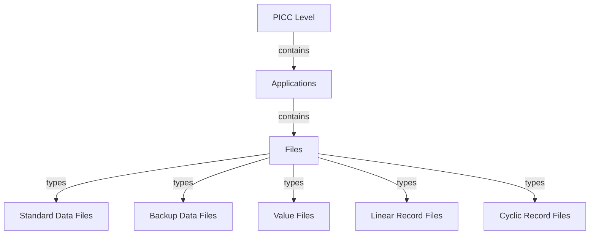
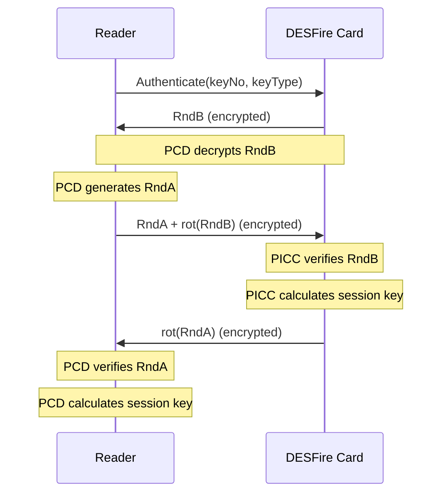
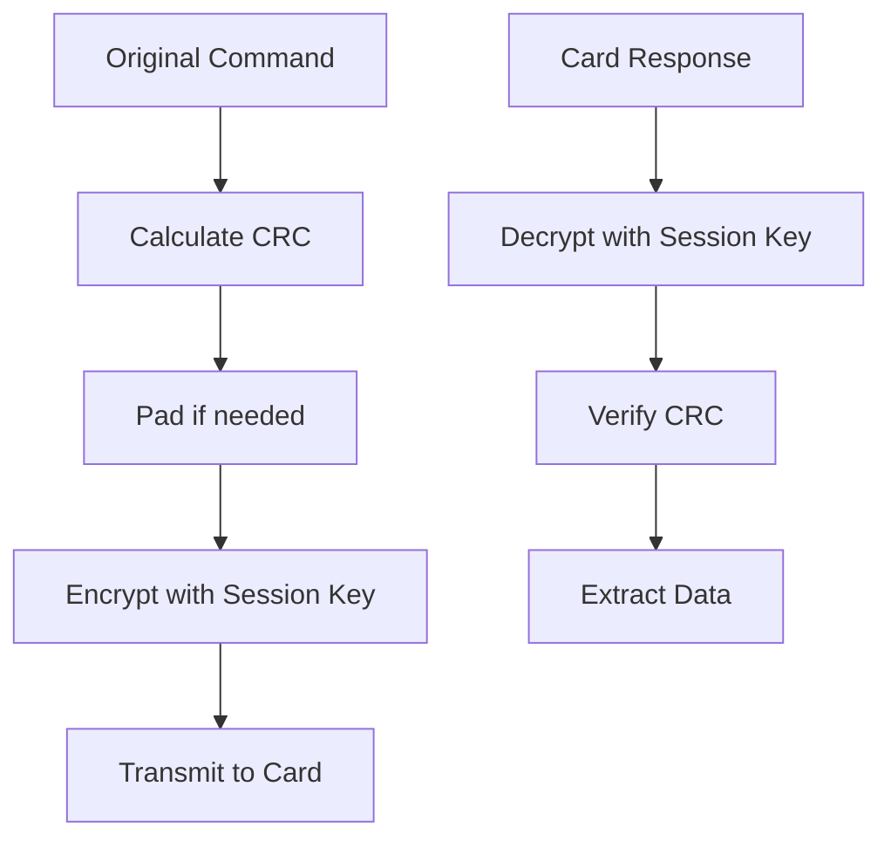

# MIFARE DESFire EV1 Protocol

## Introduction

MIFARE DESFire EV1 is a high-security contactless smart card with a flexible file system. It supports multiple applications, each with its own file structure. The card provides security through various cryptographic mechanisms including DES, 2K3DES, 3K3DES, and AES-128.

## Memory Architecture

DESFire EV1 organizes memory into applications, each containing multiple files:



- **PICC Level**: Card level, identified by AID 0x000000
- **Applications**: Up to 28 applications, each with a unique 3-byte AID
- **Files**: Up to 32 files per application, each with a unique file number (0-31)

## File Types

DESFire EV1 supports five file types:

1. **Standard Data Files**: Simple data storage
2. **Backup Data Files**: Data storage with backup mechanism
3. **Value Files**: Storage for numeric values with built-in operations (credit, debit, etc.)
4. **Linear Record Files**: Records stored in FIFO order
5. **Cyclic Record Files**: Records stored in a circular buffer

## Security

DESFire EV1 implements a robust security system:

- **Authentication**: Mutual authentication using DES, 2K3DES, 3K3DES, or AES-128
- **Access Rights**: Each file has configurable access rights
- **Communication Modes**:
  - Plain: No encryption
  - MACed: Message authentication code for integrity
  - Enciphered: Full encryption for confidentiality

## Key Management

- Up to 14 keys per application
- Configurable key settings
- Key diversification support
- Key version tracking

## Communication Protocol

### Authentication Process



### Command Structure

All DESFire commands are sent as APDUs with the following format:

```
CLA | INS | P1 | P2 | Lc | Data | Le
```

- **CLA**: 0x90 (DESFire class)
- **INS**: Command code (e.g., 0x0A for authentication)
- **P1, P2**: Usually 0x00
- **Lc**: Length of data
- **Data**: Command-specific data
- **Le**: Expected response length (optional)

### Session Key Generation

After successful authentication, a session key is generated from the random numbers:

```mermaid
graph TD
    A[Random A] --> B{Key Type?}
    A[Random B] --> B
    B -->|DES| C[Session Key = A[0-3] | B[0-3]]
    B -->|2K3DES| D[Session Key = A[0-3] | B[0-3] | A[4-7] | B[4-7]]
    B -->|3K3DES| E[Session Key = A[0-3] | B[0-3] | A[6-9] | B[6-9] | A[12-15] | B[12-15]]
    B -->|AES| F[Session Key = A[0-3] | B[0-3] | A[12-15] | B[12-15]]
```

## Command Categories

### PICC Level Commands

- `SelectApplication`: Select an application by AID
- `CreateApplication`: Create a new application
- `DeleteApplication`: Delete an existing application
- `GetApplicationIDs`: List available applications
- `FormatPICC`: Format the card
- `GetVersion`: Get card version information
- `GetCardUID`: Get the card's UID

### Application Level Commands

- `GetFileIDs`: List files in the current application
- `GetFileSettings`: Get file configuration
- `ChangeFileSettings`: Change file access rights
- `CreateFile`: Create a new file (various types)
- `DeleteFile`: Delete an existing file

### File Level Commands

- `ReadData`: Read data from a file
- `WriteData`: Write data to a file
- `GetValue`: Read a value file
- `Credit`: Increase a value
- `Debit`: Decrease a value
- `LimitedCredit`: Perform a limited increase
- `WriteRecord`: Write a record
- `ReadRecords`: Read records
- `ClearRecordFile`: Clear all records
- `CommitTransaction`: Commit pending operations
- `AbortTransaction`: Abort pending operations

## Data Encryption Process

When using encrypted communication, the following process is applied:



## Response Codes

DESFire cards return status codes in the last byte of the response:

| Code | Description           |
| ---- | --------------------- |
| 0x00 | Operation OK          |
| 0x0C | No changes            |
| 0x1C | Illegal command code  |
| 0x1E | Integrity error       |
| 0x40 | No such key           |
| 0x7E | Length error          |
| 0x9D | Permission denied     |
| 0x9E | Parameter error       |
| 0xA0 | Application not found |
| 0xAE | Authentication error  |
| 0xAF | Additional frame      |
| 0xBE | Boundary error        |
| 0xC1 | PICC integrity error  |
| 0xCA | Command aborted       |
| 0xCD | PICC disabled error   |
| 0xCE | Count error           |
| 0xDE | Duplicate error       |
| 0xEE | EEPROM error          |
| 0xF0 | File not found        |
| 0xF1 | File integrity error  |
