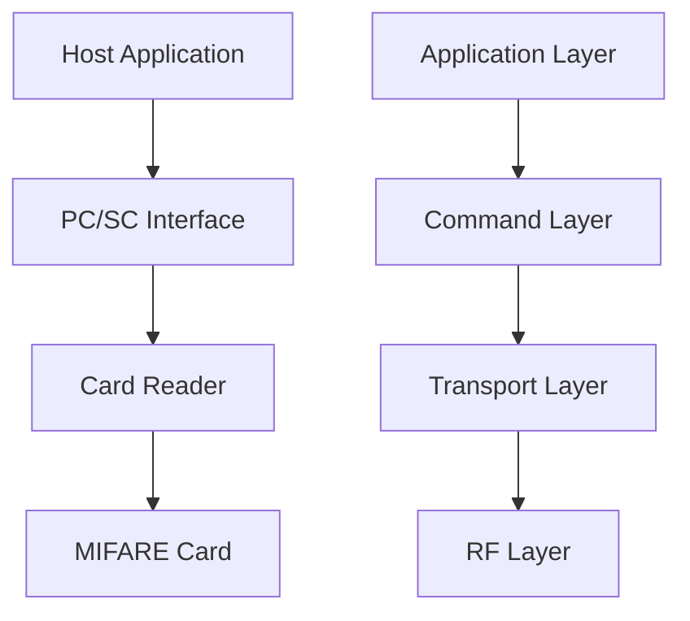
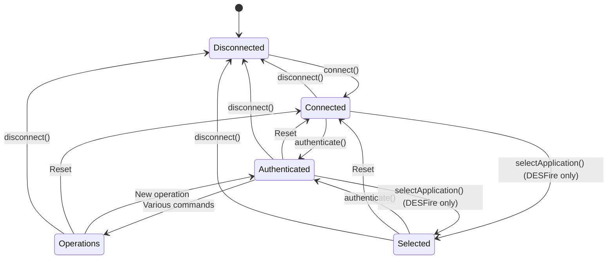

# MIFARE NFC Protocols Overview

## Introduction

MIFARE is a series of contactless smart card technologies widely used in access control systems, public transportation, and other applications. This documentation focuses on two specific MIFARE card types:

1. **MIFARE DESFire EV1** - A high-security contactless smart card with flexible memory organization
2. **MIFARE Ultralight C** - A low-cost contactless smart card with basic security features

Both types communicate using the NFC (Near Field Communication) protocol, which is based on ISO/IEC 14443. Communication with these cards involves sending command APDUs (Application Protocol Data Units) and receiving response APDUs.

## Communication Architecture

The communication follows a layered approach:

- **RF Layer**: Physical radio frequency communication (ISO/IEC 14443)
- **Transport Layer**: Handles APDU transmission and reception
- **Command Layer**: Formats specific MIFARE commands
- **Application Layer**: Application-specific logic

## Basic Concepts

### Smart Card Reader Communication

Communication with the smart cards requires a card reader compatible with the PC/SC standard. The basic operations include:

1. **Establishing a connection** with the card reader
2. **Selecting an application** on the card (for DESFire)
3. **Authentication** using cryptographic methods
4. **Command execution** (read, write, etc.)
5. **Disconnection** when operations are completed

### APDU Structure

All communication with the card uses the APDU (Application Protocol Data Unit) format:

- **Command APDU**: `CLA | INS | P1 | P2 | Lc | Data | Le`

  - CLA: Class byte (typically 0x90 for DESFire, 0xFF for Ultralight C)
  - INS: Instruction byte (the command code)
  - P1, P2: Parameter bytes
  - Lc: Length of data
  - Data: Command data (if any)
  - Le: Expected response length (if any)

- **Response APDU**: `Data | SW1 | SW2`
  - Data: Response data (if any)
  - SW1, SW2: Status words indicating the result (0x9000 for success)

## Key Differences Between DESFire EV1 and Ultralight C

| Feature             | DESFire EV1                                                  | Ultralight C                                |
| ------------------- | ------------------------------------------------------------ | ------------------------------------------- |
| Memory              | 2K, 4K, or 8K bytes                                          | 192 bytes (48 pages × 4 bytes)              |
| Application support | Multiple applications with flexible file systems             | Single application with fixed memory layout |
| Security            | DES, 2K3DES, 3K3DES, AES-128                                 | 3DES authentication only                    |
| Authentication      | Mutual authentication with key diversification               | Simple mutual authentication                |
| File system         | Supports multiple file types (Standard, Backup, Value, etc.) | Page-based direct access                    |
| Commands            | Rich command set (~35 commands)                              | Limited command set                         |

## Protocol States

This state diagram illustrates the typical flow when working with MIFARE cards. The DESFire EV1 has more complex states due to its multi-application architecture, while the Ultralight C has a simpler flow.
