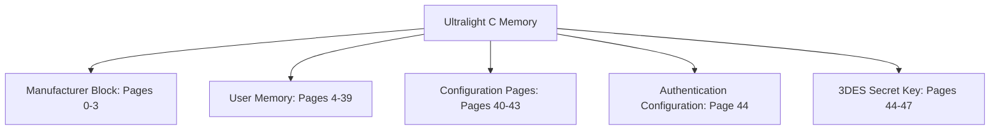
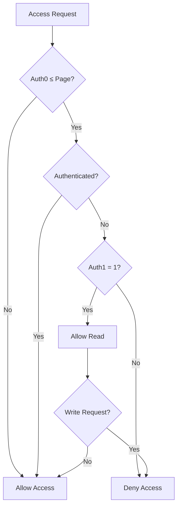
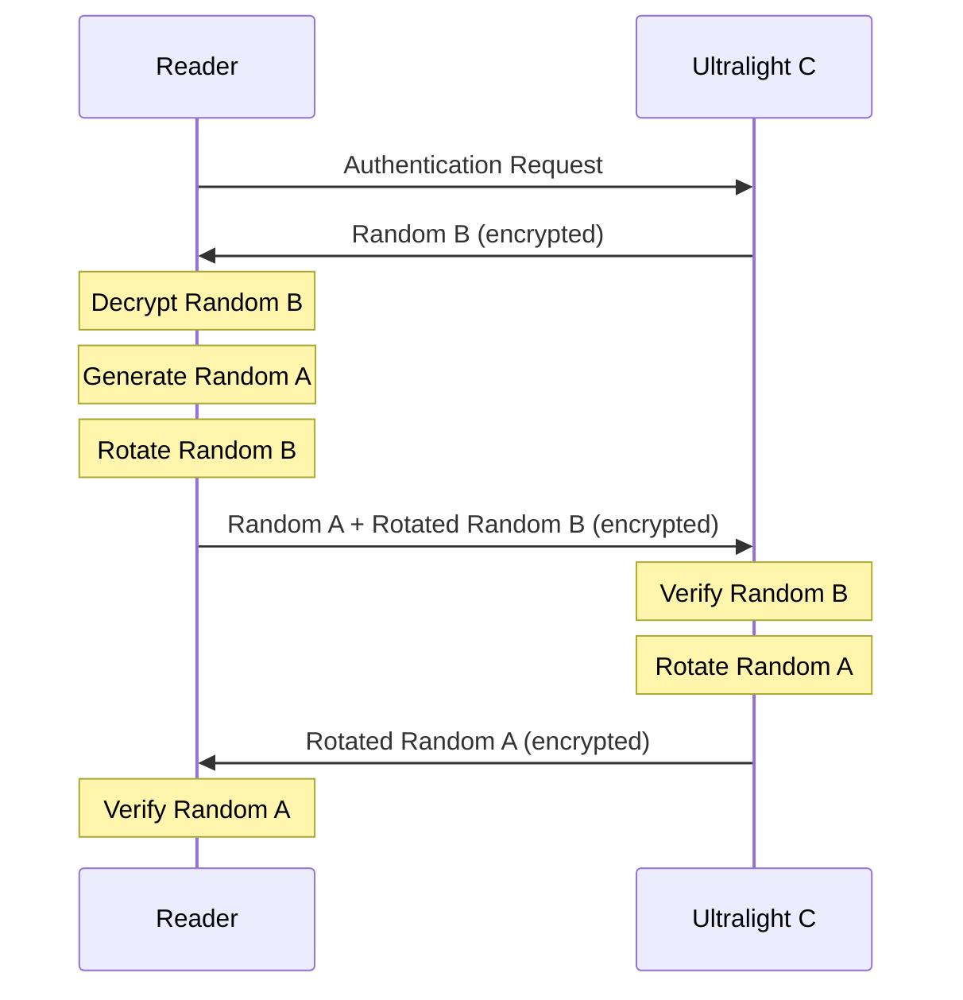
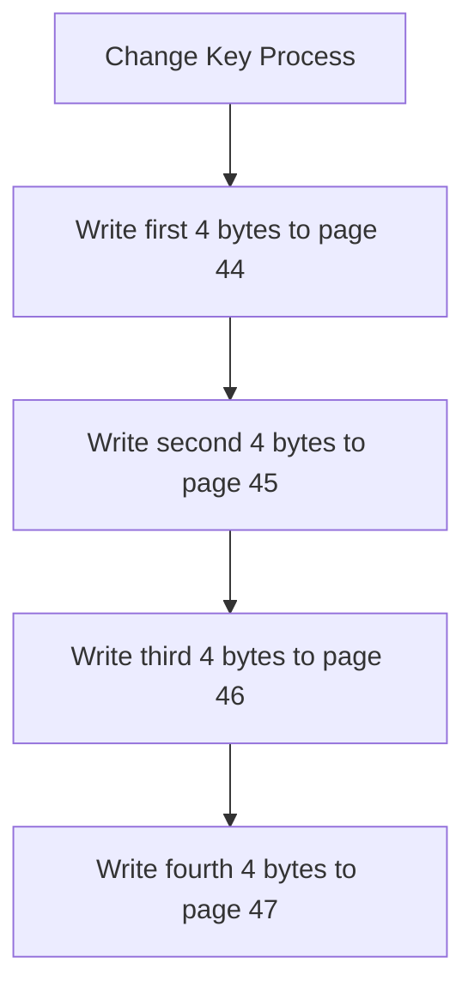
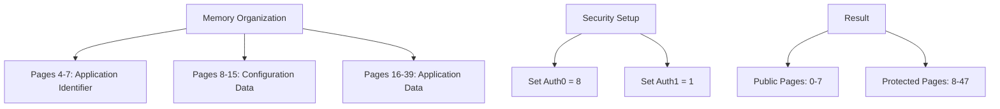

# MIFARE Ultralight C Protocol

## Introduction

MIFARE Ultralight C is a contactless smart card designed for low-cost applications. It offers 192 bytes of memory (48 pages of 4 bytes each) and includes Triple DES (3DES) authentication for basic security. Unlike the DESFire EV1, the Ultralight C has a simpler, fixed memory structure with direct page access rather than a file system.

## Memory Structure

The Ultralight C memory is organized into 48 pages of 4 bytes each:



1. **Manufacturer Block** (Pages 0-3):

   - Page 0: UID bytes 0-3
   - Page 1: UID bytes 4-7
   - Page 2: UID byte 8, Internal, Lock bytes 0-1
   - Page 3: OTP (One-Time Programmable) page

2. **User Memory** (Pages 4-39):

   - 144 bytes (36 pages) of freely available read/write memory

3. **Configuration Pages** (Pages 40-43):

   - Page 40: Lock bytes 2-4
   - Page 41: Lock bytes 5-7
   - Page 42: Auth0, Access conditions
   - Page 43: Auth1, Access conditions

4. **3DES Key** (Pages 44-47):
   - 16-byte 3DES authentication key (K1||K2)

## Security Features

### Memory Access Restrictions

The Ultralight C provides basic security through:

1. **Lock bits**: Allow pages to be set as read-only
2. **Authentication**: Pages can require authentication before access
3. **Auth0**: Page address from which authentication is required
4. **Auth1**: Defines if authentication is required for reading or only for writing



### Authentication Protocol

The Ultralight C uses Triple DES (3DES) for authentication:



## Communication Protocol

All communications with Ultralight C use the ISO/IEC 14443-4 protocol with specific command APDUs:

### Command Structure

```
CLA | INS | P1 | P2 | Lc | Data | Le
```

- **CLA**: 0xFF (Ultralight C class)
- **INS**: Command code
- **P1, P2**: Parameters (often page addresses)
- **Lc**: Length of data
- **Data**: Command data
- **Le**: Expected response length

### Basic Commands

| Command       | Description             | APDU Format                |
| ------------- | ----------------------- | -------------------------- |
| READ          | Read 4 pages            | FF B0 00 [page] 10         |
| WRITE         | Write 1 page            | FF D6 00 [page] 04 [data]  |
| AUTHENTICATE  | Start authentication    | FF EF 00 00 02 1A 00       |
| PWD_AUTH      | Password authentication | FF 1B 00 00                |
| SECTOR_SELECT | Select sector           | FF C2 00 00 02 [sector] 00 |

## Detailed Command Reference

### READ Command

Read 16 bytes starting at the specified page. Due to anticollision methods, you can only read 4 pages (16 bytes) at once.

```
APDU: FF B0 00 [page] 10
```

Response: 16 bytes of data + status

### WRITE Command

Write 4 bytes to the specified page:

```
APDU: FF D6 00 [page] 04 [4 bytes of data]
```

Response: Status (90 00 for success)

### AUTHENTICATE Command

The 3DES authentication consists of multiple command exchanges:

1. **Authentication Request**:

   ```
   APDU: FF EF 00 00 02 1A 00
   ```

   Response: AF [8 bytes encrypted random B]

2. **Authentication Part 2**:
   ```
   APDU: FF AF 00 00 11 [16 bytes encrypted (random A + rotated random B)]
   ```
   Response: 00 [8 bytes encrypted rotated random A]

### CHANGE_KEY Command

Change the 16-byte 3DES authentication key (stored in pages 44-47):



Note that key bytes are stored in reverse order within each page.

## Configuration Options

### Setting Auth0

Set the page from which authentication is required:

```
APDU: FF D6 00 2A 04 [page] 00 00 00
```

- Page value 0-47: Authentication required from that page
- Page value 0xFF: Authentication disabled

### Setting Auth1

Configure read/write restrictions for the authentication range:

```
APDU: FF D6 00 2B 04 [value] 00 00 00
```

- Value 0x00: Reading and writing require authentication
- Value 0x01: Only writing requires authentication; reading is allowed

## Memory Organization Best Practices

Since Ultralight C has a limited, linear memory structure, a common organization approach is:



This arrangement allows public access to identification information while protecting configuration and data pages.
